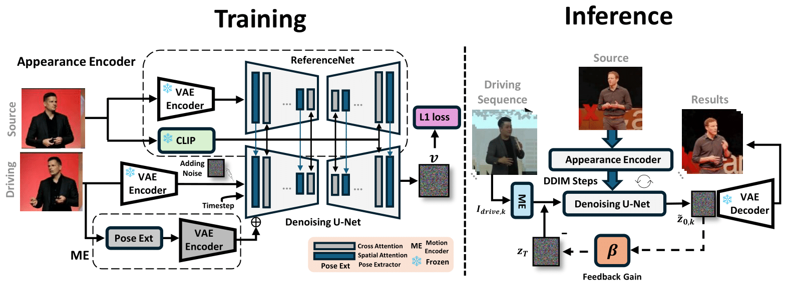

# TalkingPose: Efficient Face and Gesture Animation with Feedback-guided Diffusion Model

<p align="center">
  <a href="https://dfki-av.github.io/TalkingPose/"></a>
  <a href="https://arxiv.org/abs/2512.00909"></a>
  
  
  
  
</p>

Official implementation of the **WACV 2026** paper:  
**TalkingPose: Efficient Face and Gesture Animation with Feedback-guided Diffusion Model**

**Project page:** https://dfki-av.github.io/TalkingPose/



---

## Overview

Diffusion models have recently advanced the realism and generalizability of character-driven animation, enabling high-quality motion synthesis from a single RGB image and driving poses. However, generating **temporally coherent long-form** content remains challenging: many existing methods are trained on short clips due to computational and memory constraints, limiting their ability to maintain consistency over extended sequences.

We propose **TalkingPose**, a diffusion-based framework designed for **long-form, temporally consistent** upper-body human animation. TalkingPose uses driving frames to capture expressive facial and hand motion and transfers them to a target identity through a Stable Diffusion backbone. To improve temporal consistency without additional training stages or computational overhead, we introduce a **feedback-guided mechanism** built upon image-based diffusion models. This design enables generation with **unbounded duration**. In addition, we introduce a large-scale dataset to support benchmarking for upper-body human animation.

---

## Getting Started

### Prerequisites
- Python **>= 3.10**
- CUDA **11.7**

---

## Installation

### 1. Clone the repository
```bash
git clone https://github.com/dfki-av/TalkingPose.git
cd TalkingPose
```

### 2. Create and activate a virtual environment
```bash
python -m venv tk_pose_venv
source tk_pose_venv/bin/activate
```

### 3. Install dependencies
```bash
pip install --index-url https://download.pytorch.org/whl/cu117 \
  torch==2.0.1+cu117 torchvision==0.15.2+cu117 torchaudio==2.0.2+cu117
pip install -r requirements.txt
```

### 4. Download pre-trained checkpoints
```bash
python tools/download_weights.py
```

---

## Pose Extraction

### Extract DWPose (required for training and inference)
```bash
python tools/extract_dwpose_from_vid.py \
  --video_root /path/to/mp4_videos \
  --save_dir /path/to/save_dwpose
```

### Extract metadata for training
```bash
python tools/extract_meta_info.py \
  --video_root /path/to/videos \
  --dwpose_root /path/to/dwpose_output \
  --dataset_name <your_dataset_name> \
  --out_dir /path/to/output_meta_json
```

---

## Training

After pose extraction and metadata generation, update the training configuration to specify:
- metadata JSON paths
- checkpoint paths
- output directory

Then run:
```bash
python train.py --config configs/train/training.yaml
```

---

## Inference

For self-identity animation, specify the checkpoint path and the video and pose directories in the configuration file.

**Note:** Video folders and their corresponding pose folders must share the same directory names.

```bash
python -m scripts.pose2vid --config configs/prompts/self_identity.yaml
```

---

## Dataset

The `dataset/` directory contains `video_ids.csv`, which lists the YouTube video IDs included in the TalkingPose dataset.

To download the videos, please use **yt-dlp**:  
https://github.com/yt-dlp/yt-dlp

---

## Temporal Jittering Error (TJE) Evaluation

To evaluate generated videos using the average temporal jittering error:
```bash
python tools/tje_error.py \
  --real_dir /path/to/real_videos \
  --gen_dir /path/to/generated_videos \
  --delta 2 \
  --out
```

---

## Acknowledgements

This repository builds mainly upon and is inspired by the following works:
- Moore-AnimateAnyone: https://github.com/MooreThreads/Moore-AnimateAnyone/tree/master
- DWPose: https://github.com/IDEA-Research/DWPose
  
This work has been partially supported by the EU projects CORTEX2 (GA No. 101070192) and LUMINOUS (GA No. 101135724).

---

## Citation

If you find this work useful, please cite:

```bibtex
@inproceedings{javanmardi2026talkingpose,
  title={TalkingPose: Efficient Face and Gesture Animation with Feedback-guided Diffusion Model},
  author={Javanmardi, Alireza and Jaiswal, Pragati and Habtegebrial, Tewodros Amberbir and Millerdurai, Christen and Wang, Shaoxiang and Pagani, Alain and Stricker, Didier},
  booktitle={Proceedings of the IEEE/CVF Winter Conference on Applications of Computer Vision},
  pages={3098--3108},
  year={2026}
}
```

---

## To-do / Release Plan

- [x] **Inference code**
- [x] **Pretrained models**
- [x] **Training code**
- [x] **Training data**
- [ ] **Annotations** (will be released soon)

